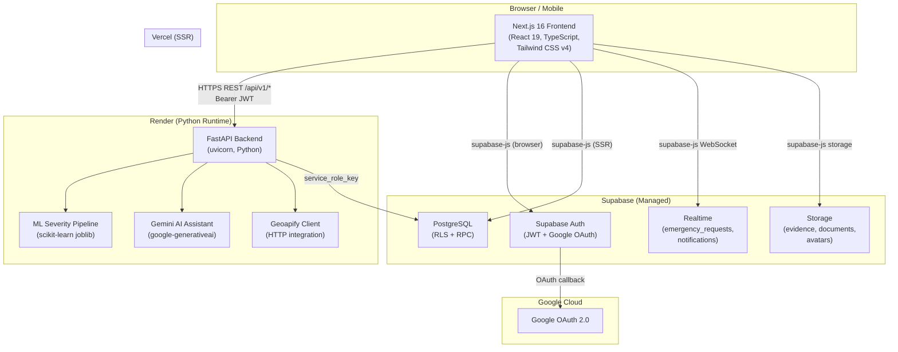
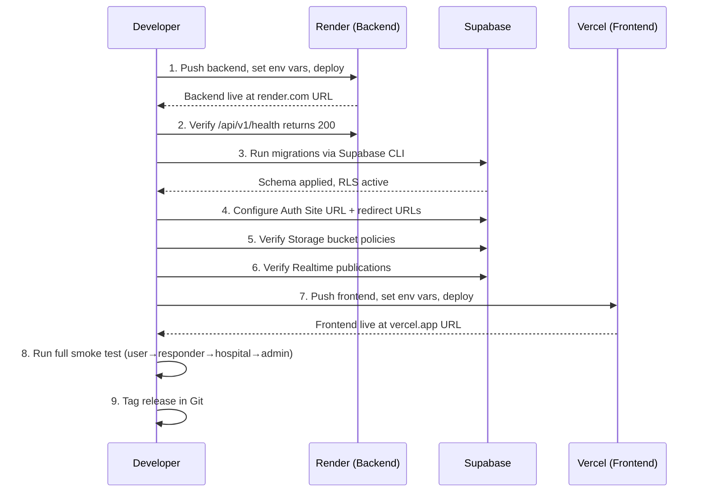
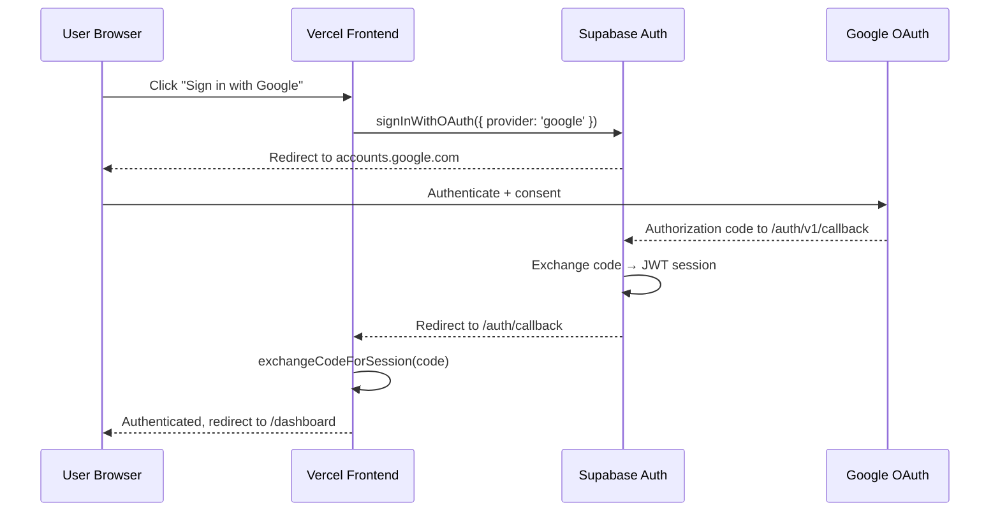

# Design Document: Medicare Production Deployment

## Overview

This document specifies the end-to-end production deployment of the Medicare emergency assistance
platform. Medicare is a full-stack application with a Next.js 16 / React 19 frontend (Vercel),
a FastAPI / Python backend (Render), and Supabase handling database, authentication, storage, and
realtime updates. The deployment covers environment configuration, security hardening, service
wiring, ML model packaging, OAuth setup, smoke testing, monitoring, rollback, and release tagging.

The deployment goal is a zero-downtime, security-reviewed production launch that preserves all
existing free-tier constraints while establishing the operational baseline for future scaling.

---

## Architecture

### High-Level System Diagram



### Deployment Order Sequence



---

## Components and Interfaces

### Component 1: Frontend (Vercel)

**Purpose**: Server-side rendered Next.js application serving four user portals
(User, Responder, Hospital, Admin) over HTTPS.

**Vercel Project Configuration**:
```typescript
// Vercel dashboard settings
interface VercelProjectConfig {
  rootDirectory: "frontend";           // CRITICAL — monorepo root != frontend
  framework: "nextjs";
  buildCommand: "next build";
  outputDirectory: ".next";
  installCommand: "npm ci";
  nodeVersion: "20.x";
}
```

**Required Environment Variables (Vercel)**:
```typescript
interface FrontendEnvVars {
  NEXT_PUBLIC_SUPABASE_URL: string;   // https://<project>.supabase.co
  NEXT_PUBLIC_SUPABASE_ANON_KEY: string;
  NEXT_PUBLIC_API_URL: string;        // https://<service>.onrender.com
  NEXT_PUBLIC_SITE_URL: string;       // https://<project>.vercel.app
}
```

**Security Headers (next.config.ts)**:
```typescript
// Production CSP — replaces localhost connect-src with production origins
const productionCSP = [
  "default-src 'self'",
  "script-src 'self' 'unsafe-eval' 'unsafe-inline'",
  "style-src 'self' 'unsafe-inline' https://unpkg.com",
  "img-src 'self' data: https://*.supabase.co https://tile.openstreetmap.org " +
    "https://lh3.googleusercontent.com https://unpkg.com",
  // PRODUCTION: replace localhost with actual backend origin
  "connect-src 'self' https://*.supabase.co wss://*.supabase.co " +
    "https://<service>.onrender.com",
  "frame-ancestors 'none'",
].join("; ");

// Additional headers
const additionalHeaders = [
  { key: "X-Content-Type-Options",  value: "nosniff" },
  { key: "X-Frame-Options",         value: "DENY" },
  { key: "Referrer-Policy",         value: "strict-origin-when-cross-origin" },
  { key: "Permissions-Policy",      value: "camera=(), microphone=(), geolocation=(self)" },
  // HSTS — enable after confirming HTTPS-only traffic
  { key: "Strict-Transport-Security", value: "max-age=63072000; includeSubDomains" },
];
```

**API Client Safety Check (lib/api/client.ts)**:
```typescript
// PRODUCTION GUARD: API_URL must not resolve to localhost
const API_URL = (process.env.NEXT_PUBLIC_API_URL ?? "").replace(/\/$/, "");

// Build-time assertion (add to CI pre-deploy step)
if (process.env.NODE_ENV === "production" && API_URL.includes("localhost")) {
  throw new Error("NEXT_PUBLIC_API_URL must not point to localhost in production");
}
```

---

### Component 2: Backend (Render)

**Purpose**: FastAPI REST API providing emergency management, ML severity prediction,
AI assistant (Gemini), recommendation engine, and nearby services (Geoapify).

**Render Service Configuration**:
```python
# render.yaml (or Dashboard settings equivalent)
class RenderServiceConfig:
    name: str = "medicare-backend"
    type: str = "web"
    runtime: str = "python"          # Render Python runtime
    rootDirectory: str = "backend"
    buildCommand: str = "pip install -r requirements.txt && pip install -r requirements-ml.txt"
    startCommand: str = "uvicorn app.main:app --host 0.0.0.0 --port $PORT"
    healthCheckPath: str = "/api/v1/health"
    pythonVersion: str = "3.12"      # declared in backend/.python-version
```

**Python Version Declaration** (file: `backend/.python-version`):
```
3.12
```

**Required Environment Variables (Render)**:
```python
# All variables set in Render dashboard → Environment
class BackendEnvVars:
    # Application
    APP_ENV: str = "production"
    DEBUG: str = "false"
    APP_VERSION: str = "1.0.0"

    # CORS — JSON array, production frontend origin only
    BACKEND_CORS_ORIGINS: str = '["https://<project>.vercel.app"]'
    FRONTEND_URL: str = "https://<project>.vercel.app"

    # Supabase (required — server-side only, never expose to client)
    SUPABASE_URL: str = "https://<project>.supabase.co"
    SUPABASE_ANON_KEY: str = "<anon-key>"
    SUPABASE_SERVICE_ROLE_KEY: str = "<service-role-key>"  # never public

    # Gemini AI (backend-only secret)
    GEMINI_API_KEY: str = "<gemini-key>"
    GEMINI_MODEL: str = "gemini-2.5-flash"
    AI_ASSISTANT_ENABLED: str = "true"
    AI_RATE_LIMIT_PER_MINUTE: str = "10"
    AI_RATE_LIMIT_PER_DAY: str = "100"

    # Geoapify (backend-only secret)
    GEOAPIFY_ENABLED: str = "true"
    GEOAPIFY_API_KEY: str = "<geoapify-key>"
    GEOAPIFY_TIMEOUT_SECONDS: str = "10"

    # Hugging Face (optional, disabled by default)
    HF_PROVIDER_ENABLED: str = "false"

    # ML severity prediction
    ML_SEVERITY_ENABLED: str = "true"
    ML_SEVERITY_CONFIDENCE_THRESHOLD: str = "0.65"
    ML_SEVERITY_RATE_LIMIT_PER_MINUTE: str = "10"
```

**CORS Configuration** (validated in `app/core/config.py` via `_parse_cors_origins`):
```python
# Production: single explicit origin — no wildcard
BACKEND_CORS_ORIGINS = '["https://<project>.vercel.app"]'

# If custom domain is configured:
# BACKEND_CORS_ORIGINS = '["https://medicare.example.com"]'

# INVALID in production — will cause preflight failures for credentialed requests:
# BACKEND_CORS_ORIGINS = '["*"]'   ← browser rejects credentials + wildcard
```

---

### Component 3: Supabase Infrastructure

**Purpose**: Managed PostgreSQL, JWT authentication, object storage, and realtime pub/sub.

**Auth URL Configuration** (Supabase Dashboard → Authentication → URL Configuration):
```
Site URL:         https://<project>.vercel.app
Redirect URLs:
  https://<project>.vercel.app/auth/callback
  https://<project>.vercel.app/**
```

**Storage Bucket Policies**:
```sql
-- Four buckets required in production
-- All buckets: private (no public access unless explicitly listed)

-- 1. evidence — emergency images uploaded by users
--    INSERT: authenticated users (own requests only, via RLS)
--    SELECT: authenticated users (own) + responders + hospitals + admins
--    DELETE: admins only

-- 2. application-documents — hospital/responder registration documents
--    INSERT: authenticated users (own application)
--    SELECT: uploader + admins

-- 3. profile-avatars — user profile pictures
--    INSERT/UPDATE: authenticated user (own profile)
--    SELECT: any authenticated user

-- 4. hospital-documents — hospital operational documents
--    INSERT/UPDATE: hospital role users
--    SELECT: hospital role + admins
```

**Realtime Publications** (verify in Supabase Dashboard → Database → Replication):
```sql
-- Tables that MUST be in supabase_realtime publication:
-- emergency_requests  — status updates pushed to responders/hospitals
-- notifications       — real-time alert delivery to all portal types
-- messages            — in-app messaging between user↔responder
-- responder_locations — live responder position updates

-- Verification query (run in SQL editor):
SELECT schemaname, tablename
FROM pg_publication_tables
WHERE pubname = 'supabase_realtime'
ORDER BY tablename;
```

---

### Component 4: Google OAuth

**Purpose**: Social login via Supabase Auth, which proxies Google OAuth 2.0.

**Google Cloud Console Configuration** (APIs & Services → Credentials → OAuth 2.0):
```
Authorized JavaScript Origins:
  https://<project>.supabase.co

Authorized Redirect URIs:
  https://<project>.supabase.co/auth/v1/callback
```

**Supabase Dashboard** (Authentication → Providers → Google):
```
Client ID:     <google-oauth-client-id>
Client Secret: <google-oauth-client-secret>
Enabled:       true
```

**Production OAuth Flow Verification**:


---

## Data Models

### Migration Sequence

```typescript
// 16 migrations applied in order (supabase db push or supabase migration up)
interface MigrationManifest {
  migrations: Array<{
    filename: string;
    description: string;
  }>;
}

const migrations = [
  { filename: "20260714194711_create_emergency_requests.sql",    description: "Core emergency request tables" },
  { filename: "20260714194712_create_emergency_evidence_storage.sql", description: "Evidence storage buckets" },
  { filename: "20260714210600_add_responder_assignment.sql",     description: "Responder assignment tracking" },
  { filename: "20260714220000_create_responder_locations.sql",   description: "Live responder location table" },
  { filename: "20260714230000_add_notifications_and_messaging.sql", description: "Notifications + messages" },
  { filename: "20260714231000_add_contacts_profile_settings.sql", description: "Emergency contacts + settings" },
  { filename: "20260715001000_enable_profiles_rls.sql",          description: "RLS on profiles" },
  { filename: "20260715120000_database_architecture_audit.sql",  description: "Architecture normalisation" },
  { filename: "20260715130000_database_constraints_indexes.sql", description: "FK constraints + indexes" },
  { filename: "20260715140000_database_rls_rpc.sql",             description: "Full RLS + RPC definitions" },
  { filename: "20260715150000_configure_realtime_updates.sql",   description: "Realtime pub config" },
  { filename: "20260715160000_add_ai_assistant.sql",             description: "AI conversation tables" },
  { filename: "20260715200000_add_hospital_portal.sql",          description: "Hospital portal schema" },
  { filename: "20260715210000_add_portal_applications.sql",      description: "Application review workflow" },
  { filename: "20260715220000_add_admin_functions.sql",          description: "Admin RPC functions" },
  { filename: "20260716000000_fix_audit_rpc_grants.sql",         description: "Audit RPC permission fix" },
];
```

### ML Artifact Manifest

```python
# Artifacts loaded by ModelRegistry.get() at startup
# Path resolution: Path(__file__).parent.parent / "artifacts"
# On Render Linux: /opt/render/project/src/backend/ml/severity/artifacts/

class MLArtifacts:
    ARTIFACTS_DIR: Path = Path("backend/ml/severity/artifacts")

    # Required files — startup fails (503) if any are missing
    PIPELINE:       str = "severity_pipeline.joblib"  # scikit-learn Pipeline
    METADATA:       str = "metadata.json"              # model_version, labels, thresholds
    LABEL_MAP:      str = "label_map.json"             # int → severity string mapping

    # Supplementary files (informational, not loaded at runtime)
    MODEL_METADATA: str = "model_metadata.json"
    METRICS:        str = "metrics.json"
    LABEL_MAPPING:  str = "label_mapping.json"         # alias of label_map
    TRAINING_SUM:   str = "training_summary.json"

    # Model config (drives training, not serving)
    CONFIG:         str = "config.json"                # severity-v1, safety-v1, threshold=0.65

# CRITICAL: These files MUST be committed to Git (not in .gitignore)
# They contain no secrets — only trained weights and numeric metadata.
# Windows path separators are irrelevant on Render (Linux uses /); Path() handles this.
```

---

## Algorithmic Pseudocode

### Pre-Deployment Verification Algorithm

```pascal
ALGORITHM pre_deployment_checklist()
INPUT:  workspace root directory
OUTPUT: pass/fail with blocking issues list

BEGIN
  issues ← []

  // 1. TypeScript compilation
  result ← run("cd frontend && npx tsc --noEmit")
  IF result.exit_code ≠ 0 THEN
    issues.append("TypeScript errors: " + result.stderr)
  END IF

  // 2. Frontend production build
  result ← run("cd frontend && npm run build")
  IF result.exit_code ≠ 0 THEN
    issues.append("Next.js build failed: " + result.stderr)
  END IF

  // 3. No hardcoded localhost in frontend source
  matches ← grep("localhost:8000", "frontend/", exclude=[".env*", "*.md"])
  IF matches.count > 0 THEN
    issues.append("Hardcoded localhost found in: " + matches.files)
  END IF

  // 4. Secret scanning
  patterns ← ["supabase_service_role", "GEMINI_API_KEY", "GEOAPIFY_API_KEY"]
  FOR each pattern IN patterns DO
    hits ← git_grep(pattern, staged=true)
    IF hits.count > 0 THEN
      issues.append("Secret in staged files: " + hits)
    END IF
  END FOR

  // 5. ML artifacts present
  required_artifacts ← ["severity_pipeline.joblib", "metadata.json", "label_map.json"]
  FOR each artifact IN required_artifacts DO
    IF NOT file_exists("backend/ml/severity/artifacts/" + artifact) THEN
      issues.append("Missing ML artifact: " + artifact)
    END IF
  END FOR

  // 6. .gitignore safety
  IF NOT ".env" IN read_file("backend/.gitignore") THEN
    issues.append(".env not in backend/.gitignore")
  END IF
  IF NOT ".env.local" IN read_file("frontend/.gitignore") THEN
    issues.append(".env.local not in frontend/.gitignore")
  END IF

  IF issues.length > 0 THEN
    RETURN Fail(issues)
  END IF
  RETURN Pass()
END
```

### Backend Health Check Algorithm

```pascal
ALGORITHM verify_backend_health(render_url: String)
INPUT:  render_url — the Render service base URL (e.g. https://medicare-backend.onrender.com)
OUTPUT: pass/fail

BEGIN
  // Step 1: Liveness check
  response ← HTTP_GET(render_url + "/api/v1/health")
  ASSERT response.status = 200
  ASSERT response.json.status = "healthy"
  ASSERT response.json.environment = "production"

  // Step 2: Docs must be disabled in production (main.py gates on _is_dev)
  docs_response ← HTTP_GET(render_url + "/docs")
  ASSERT docs_response.status = 404

  // Step 3: Auth returns safe 401 (not 500) for unauthenticated request
  me_response ← HTTP_GET(render_url + "/api/v1/auth/me")
  ASSERT me_response.status = 401
  ASSERT me_response.json.success = false
  // Verify no stack trace, database errors, or secrets in response body
  ASSERT "traceback" NOT IN me_response.json.message.lower()
  ASSERT "secret" NOT IN me_response.json.message.lower()

  // Step 4: CORS preflight from production frontend origin
  cors_response ← HTTP_OPTIONS(
    url = render_url + "/api/v1/health",
    headers = { "Origin": vercel_url, "Access-Control-Request-Method": "GET" }
  )
  ASSERT "access-control-allow-origin" IN cors_response.headers
  ASSERT cors_response.headers["access-control-allow-origin"] = vercel_url

  RETURN Pass()
END
```

### Frontend Production Verification Algorithm

```pascal
ALGORITHM verify_frontend_production(vercel_url: String)
INPUT:  vercel_url — the Vercel deployment URL
OUTPUT: pass/fail

BEGIN
  // Step 1: Root page loads (HTTP 200)
  response ← HTTP_GET(vercel_url)
  ASSERT response.status = 200

  // Step 2: Security headers present
  headers ← response.headers
  ASSERT "x-content-type-options" IN headers
  ASSERT headers["x-content-type-options"] = "nosniff"
  ASSERT "x-frame-options" IN headers
  ASSERT headers["x-frame-options"] = "DENY"
  ASSERT "content-security-policy" IN headers
  // Ensure CSP does not contain localhost
  csp ← headers["content-security-policy"]
  ASSERT "localhost" NOT IN csp

  // Step 3: No mixed content (all resources over HTTPS)
  page_html ← HTTP_GET(vercel_url).body
  ASSERT "http://" NOT IN page_html  // No plain HTTP resource references

  // Step 4: API URL resolved correctly
  // Check NEXT_PUBLIC_API_URL is the Render URL, not localhost
  // (Verified by absence of localhost in the JS bundle connect-src)
  ASSERT "localhost:8000" NOT IN page_html

  RETURN Pass()
END
```

### Production Smoke Test Algorithm

```pascal
ALGORITHM production_smoke_test(vercel_url: String, render_url: String)
INPUT:  vercel_url, render_url
OUTPUT: pass/fail with step-by-step results

BEGIN
  results ← []

  // ── 1. User Portal ──────────────────────────────────────────────────────
  // Sign up / sign in via email+password (Supabase Auth)
  session ← supabase_auth.signInWithPassword(TEST_USER_EMAIL, TEST_USER_PASSWORD)
  ASSERT session.access_token IS NOT NULL
  results.append("✓ User auth: JWT obtained")

  // Submit emergency request
  req ← HTTP_POST(
    render_url + "/api/v1/emergency-requests",
    headers = { Authorization: "Bearer " + session.access_token },
    body = { emergency_type: "medical", description: "smoke test", location: TEST_COORDS }
  )
  ASSERT req.status = 201
  emergency_id ← req.json.data.id
  results.append("✓ Emergency request created: " + emergency_id)

  // Severity prediction
  pred ← HTTP_POST(render_url + "/api/v1/ml/severity/predict", ...)
  ASSERT pred.status = 200
  ASSERT pred.json.data.predicted_severity IN ["low","medium","high","critical"]
  results.append("✓ ML severity prediction: " + pred.json.data.predicted_severity)

  // Recommendation
  rec ← HTTP_POST(render_url + "/api/v1/recommendations", ...)
  ASSERT rec.status = 200
  results.append("✓ Recommendation engine: responded")

  // ── 2. Responder Portal ──────────────────────────────────────────────────
  responder_session ← supabase_auth.signInWithPassword(TEST_RESPONDER_EMAIL, TEST_RESPONDER_PASSWORD)
  ASSERT responder_session.access_token IS NOT NULL
  results.append("✓ Responder auth: JWT obtained")

  // ── 3. Hospital Portal ───────────────────────────────────────────────────
  hospital_session ← supabase_auth.signInWithPassword(TEST_HOSPITAL_EMAIL, TEST_HOSPITAL_PASSWORD)
  ASSERT hospital_session.access_token IS NOT NULL
  results.append("✓ Hospital auth: JWT obtained")

  // ── 4. Admin Portal ──────────────────────────────────────────────────────
  admin_session ← supabase_auth.signInWithPassword(TEST_ADMIN_EMAIL, TEST_ADMIN_PASSWORD)
  // Admin application review
  apps ← HTTP_GET(render_url + "/api/v1/admin/applications", admin_session)
  ASSERT apps.status = 200
  results.append("✓ Admin portal: application list accessible")

  // ── 5. Realtime ──────────────────────────────────────────────────────────
  // Subscribe to emergency_requests changes via Supabase Realtime
  channel ← supabase.channel("test-channel")
    .on("postgres_changes", { event: "*", schema: "public", table: "emergency_requests" }, handler)
    .subscribe()
  ASSERT channel.status = "SUBSCRIBED"
  results.append("✓ Realtime: subscription established")

  // ── 6. Google OAuth (manual step — automated flow blocked by browser) ────
  results.append("⚠ Google OAuth: verify manually in browser")

  RETURN Pass(results)
END
```

---

## Key Functions with Formal Specifications

### Function: `pre_deploy_secret_scan()`

```python
def pre_deploy_secret_scan(repo_root: Path) -> list[str]:
    """Scan staged/committed files for accidental secret exposure."""
```

**Preconditions**:
- `repo_root` is a valid Git repository root
- All files intended for commit are staged

**Postconditions**:
- Returns empty list if no secrets found (safe to deploy)
- Returns list of `"<file>:<line>: <pattern>"` entries for each match
- Does not modify any files
- Patterns checked: `supabase_service_role`, `GEMINI_API_KEY`, `GEOAPIFY_API_KEY`,
  `eyJ` (JWT prefix), any 40+ char hex string in a non-.gitignore file

**Loop Invariants**:
- All previously scanned files had no matches when loop continues

---

### Function: `apply_migration_sequence()`

```python
def apply_migration_sequence(supabase_project_ref: str, migrations_dir: Path) -> MigrationResult:
    """Apply all pending migrations in chronological order."""
```

**Preconditions**:
- `supabase_project_ref` is a valid Supabase project reference
- `migrations_dir` contains all 16 migration files in correct timestamp order
- Supabase CLI is authenticated (`supabase login`)

**Postconditions**:
- All 16 migrations applied in timestamp order
- Each migration is idempotent (safe to re-run)
- RLS policies active on all user-data tables
- All RPCs granted to authenticated/service_role as appropriate
- Returns `MigrationResult.success` with applied count

**Error Handling**:
- If any migration fails, halt sequence and return failure with migration name
- Do not skip or reorder migrations

### Function: `verify_ml_artifacts()`

```python
def verify_ml_artifacts(artifacts_dir: Path, model_enabled: bool) -> ArtifactCheckResult:
    """Verify ML model artifacts are present, loadable, and Linux-path compatible."""
```

**Preconditions**:
- `artifacts_dir` resolves via `Path(__file__).parent.parent / "artifacts"` in model_registry.py
- `model_enabled` reflects `ML_SEVERITY_ENABLED` env var

**Postconditions**:
- If `model_enabled = True`: all three required files present and joblib-loadable
- If `model_enabled = False`: graceful 503 returned by `/api/v1/ml/severity/predict`
- Path uses `pathlib.Path` (cross-platform, Linux-safe — no Windows backslash literals)
- `ModelRegistry.get()` succeeds without `ModelUnavailableError`

**Validation**:
```python
# Required artifact existence check (mirrors model_registry.py logic)
required = [
    artifacts_dir / "severity_pipeline.joblib",
    artifacts_dir / "metadata.json",
    artifacts_dir / "label_map.json",
]
missing = [p for p in required if not p.exists()]
assert len(missing) == 0, f"Missing: {missing}"

# Load test — verify joblib can deserialize on current OS/Python version
import joblib
pipeline = joblib.load(artifacts_dir / "severity_pipeline.joblib")
assert hasattr(pipeline, "predict"), "Pipeline missing predict() method"
```

---

### Function: `configure_production_cors()`

```python
def configure_production_cors(vercel_url: str, custom_domain: str | None = None) -> str:
    """Generate production-safe CORS origins JSON array for Render env var."""
```

**Preconditions**:
- `vercel_url` is a valid HTTPS URL (starts with `https://`)
- `custom_domain` is None or a valid HTTPS URL

**Postconditions**:
- Returns JSON array string with only explicit origins
- Does NOT include `"*"` (wildcard — invalid with `allow_credentials=True`)
- Does NOT include `http://` origins (downgrade risk)
- Validates against `Settings._parse_cors_origins()` without error

```python
origins = [vercel_url]
if custom_domain:
    origins.append(custom_domain)
result = json.dumps(origins)
# Example: '["https://medicare.vercel.app","https://medicare.example.com"]'
assert "*" not in result
assert "http://" not in result
return result
```

---

## Error Handling

### Error Scenario 1: ML Model Not Available at Startup

**Condition**: `severity_pipeline.joblib` missing or corrupt on Render startup  
**Response**: `ModelUnavailableError` caught in route handler → HTTP 503 with safe message  
**Recovery**: The emergency request form still functions — ML prediction is advisory-only.
             User can manually select severity. The SOS flow is never blocked by ML failure.  
**Detection**: `GET /api/v1/ml/severity/model-info` returns `status: "unavailable"` instead of 503.

### Error Scenario 2: Supabase Auth URL Mismatch

**Condition**: Site URL in Supabase not updated to Vercel URL before deploying  
**Response**: OAuth redirects fail with `redirect_uri_mismatch` error after Google consent  
**Recovery**: Update Site URL + redirect URLs in Supabase Auth dashboard; no redeployment needed  
**Prevention**: Item #12 in deployment checklist — configure Auth URLs before frontend deploy.

### Error Scenario 3: CORS Rejection in Production

**Condition**: `BACKEND_CORS_ORIGINS` on Render doesn't include the Vercel URL  
**Response**: Browser blocks preflight; frontend shows network error with no auth token  
**Recovery**: Update `BACKEND_CORS_ORIGINS` env var on Render → redeploy (env-only change, ~1 min)  
**Detection**: Browser DevTools → Network → OPTIONS request shows missing `access-control-allow-origin`.

### Error Scenario 4: Mixed Content Blocked

**Condition**: `NEXT_PUBLIC_API_URL` set to `http://` instead of `https://` on Vercel  
**Response**: Browser blocks all API calls from HTTPS frontend to HTTP backend  
**Recovery**: Update `NEXT_PUBLIC_API_URL` to `https://` in Vercel environment variables → redeploy  
**Prevention**: Pre-deploy guard in `client.ts` that throws if `API_URL` includes `http://` in production.

### Error Scenario 5: Secret Accidentally Committed

**Condition**: `.env` or `.env.local` accidentally staged and pushed  
**Response**: Immediate security incident — all exposed secrets must be rotated  
**Recovery**:
  1. Rotate exposed key immediately (Supabase, Gemini, Geoapify dashboards)
  2. Remove from Git history: `git filter-repo --path .env --invert-paths`  
  3. Force-push all branches + notify collaborators  
**Prevention**: Secret scanning step in pre-deployment checklist; `.gitignore` verification.

---

## Testing Strategy

### Unit Testing Approach

Run existing backend test suite before deploy:
```bash
cd backend
pytest tests/ -v --tb=short
```

Key test coverage areas:
- `tests/test_notifications_api.py` — notification endpoint contracts
- Health check endpoint returns correct environment field
- Auth endpoint returns 401 (not 500) for missing token
- ML severity prediction returns valid severity label

### Property-Based Testing Approach

**Property Test Library**: `hypothesis` (Python) for backend properties

Key properties to verify:
1. For any valid `SeverityPredictionRequest`, the response `predicted_severity` is always
   one of `["low", "medium", "high", "critical"]` — never null or out-of-enum.
2. For any CORS origin string, `Settings._parse_cors_origins()` never returns `["*"]`
   when given an explicit list.
3. For any `RequestValidationError`, the HTTP response body never contains a raw Python
   traceback or the word "traceback".
4. For any request with an expired/invalid JWT, all protected endpoints return exactly 401.

### Integration Testing Approach

Post-deployment smoke test (`production_smoke_test()` algorithm above) covers:
- Full auth flow (email + Google OAuth)
- Emergency request lifecycle (create → ML predict → recommend → realtime update)
- All four portal types (user, responder, hospital, admin)
- Health check and docs-disabled verification

---

## Performance Considerations

### Free-Tier Constraints

| Service   | Constraint                           | Mitigation                              |
|-----------|--------------------------------------|-----------------------------------------|
| Render    | Free tier spins down after 15 min idle | First request after cold start ~30–60s; document for users |
| Vercel    | 100 GB bandwidth/month (Hobby)       | Optimize image sizes; use Next.js Image component |
| Supabase  | 500 MB database, 1 GB storage (Free) | Monitor usage; ML artifacts ~5 MB, well within limit |
| Gemini    | Rate limit: 10 req/min, 100/day (config) | AI rate limiting already in config.py; return 429 gracefully |
| Geoapify  | Free tier: 3,000 credits/day         | Caching in `geoapify_client.py`; `GEOAPIFY_TIMEOUT_SECONDS=10` |

### Cold Start Handling

```python
# Render cold start sequence (~30-60s on free tier):
# 1. Container starts
# 2. pip install (if not cached)
# 3. FastAPI lifespan startup
# 4. ModelRegistry.get() — loads ~5 MB joblib pipeline
# 5. Supabase client initialization
# 6. First /api/v1/health returns 200

# Frontend should implement retry with exponential backoff for initial API calls:
async function callWithRetry(fn, maxRetries = 3, baseDelay = 1000) {
  for (let i = 0; i < maxRetries; i++) {
    try {
      return await fn();
    } catch (err) {
      if (i === maxRetries - 1) throw err;
      await sleep(baseDelay * Math.pow(2, i));
    }
  }
}
```

---

## Security Considerations

### Secret Classification

| Secret                        | Location          | Exposure Scope       |
|-------------------------------|-------------------|----------------------|
| `SUPABASE_SERVICE_ROLE_KEY`   | Render env only   | Backend only — never expose to client |
| `GEMINI_API_KEY`              | Render env only   | Backend only |
| `GEOAPIFY_API_KEY`            | Render env only   | Backend only |
| `SUPABASE_ANON_KEY`           | Vercel env + Render | Safe to expose in browser JS (RLS enforced) |
| `NEXT_PUBLIC_SUPABASE_URL`    | Vercel env        | Public — intentional |
| `NEXT_PUBLIC_API_URL`         | Vercel env        | Public — intentional |
| `GOOGLE_OAUTH_CLIENT_SECRET`  | Supabase dashboard | Never in code |

### RLS Verification

```sql
-- Verify RLS is enabled on all user-data tables (run in Supabase SQL editor)
SELECT tablename, rowsecurity
FROM pg_tables
WHERE schemaname = 'public'
  AND tablename IN (
    'emergency_requests', 'profiles', 'notifications', 'messages',
    'responder_locations', 'emergency_contacts', 'organizations',
    'ai_conversations', 'ai_messages'
  )
ORDER BY tablename;

-- Expected: rowsecurity = TRUE for all rows
-- Any FALSE result is a deployment blocker
```

### Logging Safety

The application already implements logging safety:
- `Settings.__repr__()` masks sensitive keys with `***HIDDEN***`
- `SeverityPredictionService.predict()` only logs `emergency_type`, `age_group`, booleans — never description text
- `RequestIDMiddleware` validates UUID format to prevent log injection
- Exception handlers return generic messages, not raw tracebacks

---

## Deployment Documentation Structure

The following documentation files must be created as part of the deployment:

```
docs/
└── deployment/
    ├── README.md              # Overview, deployment order, rollback summary
    ├── vercel.md              # Vercel setup: root dir, env vars, SSR mode
    ├── render.md              # Render setup: Python version, start command, env vars
    ├── supabase.md            # Migrations, Auth URLs, Storage policies, Realtime
    ├── google-oauth.md        # Google Cloud Console config + Supabase provider setup
    └── smoke-tests.md         # Step-by-step post-deployment verification checklist
```

---

## Rollback Plan

### Backend Rollback (Render)

```pascal
ALGORITHM rollback_backend()
BEGIN
  // Option 1: Render dashboard → deploys → select previous successful deploy → "Rollback"
  // Time to rollback: ~2-3 minutes

  // Option 2: Git revert + push
  git revert HEAD --no-edit
  git push origin main
  // Render auto-deploys on push

  // Option 3: Environment variable rollback
  // If issue is env-only: update vars in Render dashboard → "Manual Deploy"
END
```

### Frontend Rollback (Vercel)

```pascal
ALGORITHM rollback_frontend()
BEGIN
  // Vercel dashboard → project → deployments → select previous → "Promote to Production"
  // Time to rollback: ~30 seconds (instant promotion)

  // Git revert approach:
  git revert HEAD --no-edit
  git push origin main
END
```

### Database Rollback

```pascal
ALGORITHM rollback_database()
BEGIN
  // Migrations are NOT automatically reversible — manual SQL required
  // Before any migration: create a Supabase database backup
  // Supabase Dashboard → Settings → Database → Backups

  // For schema-only rollback: write inverse migration SQL
  // For data corruption: restore from Supabase point-in-time backup (paid tier)
  // Free tier: manual backup via pg_dump before migrations
  pg_dump_command ← "pg_dump postgresql://<connection-string> > backup.sql"
END
```

---

## Validation Commands

```bash
# ── Pre-deployment ─────────────────────────────────────────────────────────

# TypeScript check
cd frontend && npx tsc --noEmit

# Frontend build
cd frontend && npm run build

# Backend tests
cd backend && pytest tests/ -v --tb=short

# Secret scan (no .env files staged)
git diff --cached --name-only | grep -E "\.env$|\.env\.local$"
# Expected: no output

# ML artifacts present
ls backend/ml/severity/artifacts/
# Expected: severity_pipeline.joblib, metadata.json, label_map.json

# ── Post-deployment ────────────────────────────────────────────────────────

# Backend health
curl https://<service>.onrender.com/api/v1/health

# Docs disabled in production
curl -o /dev/null -w "%{http_code}" https://<service>.onrender.com/docs
# Expected: 404

# Safe 401 for unauthenticated
curl -o /dev/null -w "%{http_code}" https://<service>.onrender.com/api/v1/auth/me
# Expected: 401

# CORS preflight
curl -X OPTIONS https://<service>.onrender.com/api/v1/health \
  -H "Origin: https://<project>.vercel.app" \
  -H "Access-Control-Request-Method: GET" -v 2>&1 | grep "access-control-allow-origin"
# Expected: access-control-allow-origin: https://<project>.vercel.app

# No localhost in frontend HTML
curl https://<project>.vercel.app | grep -i "localhost"
# Expected: no output

# ── Supabase ───────────────────────────────────────────────────────────────

# Verify migrations applied
supabase db diff --linked
# Expected: no diff (all migrations applied)

# Verify RLS on all tables (run in Supabase SQL editor — see Security Considerations)

# ── Release tagging ────────────────────────────────────────────────────────

git tag -a v1.0.0-prod -m "Production deployment $(date -u +%Y-%m-%d)"
git push origin v1.0.0-prod
```

---

## Completion Checklist

```
Pre-Deployment
[ ] TypeScript compiles without errors
[ ] Frontend production build succeeds
[ ] No hardcoded localhost URLs in frontend source
[ ] .gitignore covers .env, .env.local, .env*.local
[ ] No secrets in staged Git files
[ ] ML artifacts present and loadable
[ ] Backend tests pass

Backend (Render)
[ ] Root directory set to "backend"
[ ] .python-version file created (3.12)
[ ] Build command includes requirements-ml.txt
[ ] Start command: uvicorn app.main:app --host 0.0.0.0 --port $PORT
[ ] Health check path: /api/v1/health
[ ] APP_ENV=production, DEBUG=false
[ ] All Supabase env vars set (URL, ANON_KEY, SERVICE_ROLE_KEY)
[ ] BACKEND_CORS_ORIGINS set to Vercel URL JSON array
[ ] GEMINI_API_KEY set (backend-only)
[ ] GEOAPIFY_API_KEY set (backend-only)
[ ] /api/v1/health returns 200 with environment=production
[ ] /docs returns 404
[ ] /api/v1/auth/me returns 401 (not 500)

Database (Supabase)
[ ] All 16 migrations applied in order
[ ] RLS enabled on all user-data tables
[ ] All RPCs granted to correct roles
[ ] Realtime publications verified (4 tables)
[ ] Storage bucket policies configured (4 buckets)

Auth (Supabase)
[ ] Site URL updated to Vercel URL
[ ] Redirect URLs include /auth/callback
[ ] Google OAuth client ID + secret set in Supabase
[ ] Google Cloud Console authorized origins include Supabase URL
[ ] Google Cloud Console redirect URI includes Supabase /auth/v1/callback
[ ] Email + password sign-in tested in production
[ ] Google OAuth sign-in tested in production browser

Frontend (Vercel)
[ ] Root directory set to "frontend"
[ ] NEXT_PUBLIC_SUPABASE_URL set
[ ] NEXT_PUBLIC_SUPABASE_ANON_KEY set
[ ] NEXT_PUBLIC_API_URL set to Render HTTPS URL
[ ] NEXT_PUBLIC_SITE_URL set to Vercel URL
[ ] CSP updated (localhost removed from connect-src)
[ ] HSTS header added
[ ] Deployed page has no mixed content warnings

Smoke Tests
[ ] User portal: sign up, create emergency, receive ML prediction
[ ] Responder portal: sign in, view emergencies
[ ] Hospital portal: sign in, view requests
[ ] Admin portal: sign in, review applications
[ ] Realtime subscription established
[ ] Google OAuth tested manually in browser

Release
[ ] Deployment documentation created in docs/deployment/
[ ] Git release tag v1.0.0-prod pushed
[ ] Free-tier limits documented
[ ] Rollback procedure tested (Vercel instant promotion verified)
```

---

## Dependencies

| Dependency          | Version      | Purpose                                  |
|---------------------|--------------|------------------------------------------|
| Next.js             | 16.2.10      | Frontend SSR framework                   |
| React               | 19.2.4       | UI rendering                             |
| TypeScript          | ^5           | Static typing                            |
| Tailwind CSS        | ^4           | Utility-first styling                    |
| @supabase/ssr       | ^0.6.1       | SSR-compatible Supabase client           |
| @supabase/supabase-js | ^2.49.4   | Browser Supabase client                  |
| FastAPI             | 0.139.0      | Backend REST framework                   |
| uvicorn             | 0.51.0       | ASGI server                              |
| pydantic-settings   | 2.14.2       | Environment-based config validation      |
| supabase (Python)   | 2.31.0       | Backend Supabase client                  |
| scikit-learn        | >=1.4        | ML severity prediction pipeline          |
| joblib              | >=1.3        | ML model serialization                   |
| pandas              | >=2.2        | ML feature engineering                   |
| google-generativeai | (via Gemini) | AI assistant provider                    |
| Supabase            | Managed      | PostgreSQL, Auth, Storage, Realtime      |
| Vercel              | Managed      | Frontend hosting (SSR)                   |
| Render              | Managed      | Backend hosting (Python)                 |
| Geoapify            | API          | Nearby medical services search           |

---

## Correctness Properties

*A property is a characteristic or behavior that should hold true across all valid executions of a system — essentially, a formal statement about what the system should do. Properties serve as the bridge between human-readable specifications and machine-verifiable correctness guarantees.*

The following properties must hold universally across all production deployments:

### Property 1: Secret Isolation

*For any* HTTP response from any Frontend endpoint or page, the response body and response
headers must never contain `SUPABASE_SERVICE_ROLE_KEY`, `GEMINI_API_KEY`, or `GEOAPIFY_API_KEY`
values — backend-only secrets are never visible to browser clients.

**Validates: Requirements 5.2**

### Property 2: Auth Gating

*For all* protected `/api/v1/*` endpoints (anything except `/api/v1/health`), any request without
a valid Supabase JWT must receive HTTP 401 with `success: false` — never 200, 403, or 500.

**Validates: Requirements 6.1, 6.2**

### Property 3: ML Graceful Degradation

*For all* `POST /api/v1/ml/severity/predict` requests, if `ML_SEVERITY_ENABLED=false` or any
required model artifact is missing, the response is HTTP 503 with `success: false` — never a
200 with a null or out-of-enum severity value.

**Validates: Requirements 7.2**

### Property 4: CORS Exclusivity

*For all* CORS preflight requests from origins not listed in `BACKEND_CORS_ORIGINS`, the response
must not include `Access-Control-Allow-Origin`. The wildcard `*` is never a valid value when
`allow_credentials=true` — `Settings._parse_cors_origins()` must never return `["*"]` when
given an explicit list.

**Validates: Requirements 2.6, 2.8**

### Property 5: Docs Disabled in Production

*For all* requests to `/docs`, `/redoc`, or `/openapi.json` when `APP_ENV=production`, the response
is HTTP 404 — Swagger UI is never served outside development environments.

**Validates: Requirements 2.4, 6.3**

### Property 6: RLS Enforcement

*For all* database reads via Supabase by any user in role `authenticated`, the user can only
read rows they own or are explicitly authorized to see per the applicable RLS policy — they
can never retrieve another user's emergency requests, messages, or profile by guessing a UUID.

**Validates: Requirements 3.4**

### Property 7: Migration Idempotency

*For any* clean Supabase database, applying all 16 migrations twice produces the same final
schema state as applying them once — no duplicate tables, indexes, or constraint violations
result from re-application.

**Validates: Requirements 3.2**

### Property 8: Realtime Isolation

*For any* realtime subscription to `emergency_requests` by a user in the `user` role, the
Supabase Realtime channel only delivers events for rows where `user_id = auth.uid()` — never
another user's emergencies.

**Validates: Requirements 3.6**

### Property 9: Severity Determinism

*For the same* `SeverityPredictionRequest` input submitted twice, the ML_Pipeline always returns
the same `predicted_severity` label — the scikit-learn pipeline is stateless and deterministic.

**Validates: Requirements 7.4**

### Property 10: Health Check Stability

*For any* request to `GET /api/v1/health` on a warm Render instance, the Backend always returns
HTTP 200 within 10 seconds regardless of ML model status or Gemini API availability — health
is infrastructure-level and not dependent on third-party service reachability.

**Validates: Requirements 2.3**

### Property 11: ML Severity Enum Validity

*For any* valid `SeverityPredictionRequest` input, the ML_Pipeline returns a `predicted_severity`
value that is one of `["low", "medium", "high", "critical"]` — never null and never outside
this enumeration.

**Validates: Requirements 7.3**

### Property 12: CORS Origin Validation

*For any* CORS preflight `OPTIONS` request originating from the Vercel_URL, the Backend response
includes `Access-Control-Allow-Origin` exactly equal to the Vercel_URL — never a wildcard and
never a different origin.

**Validates: Requirements 2.7**

### Property 13: API URL Localhost Guard

*For any* production Frontend build where `NEXT_PUBLIC_API_URL` contains the substring
`localhost`, the build process throws an error and the artifact is not promoted to production.

**Validates: Requirements 1.3**

### Property 14: Secret Scanner Completeness

*For any* set of staged Git files containing at least one occurrence of a secret pattern
(`supabase_service_role`, `GEMINI_API_KEY`, `GEOAPIFY_API_KEY`, `eyJ`, or a 40+ character hex
string outside `.gitignore`), the Secret_Scanner returns a non-empty list of
`<file>:<line>: <pattern>` entries and does not return an empty (safe) result.

**Validates: Requirements 5.4, 5.5**

### Property 15: Cold Start Retry Convergence

*For any* sequence of API call attempts where the Backend is healthy but experiencing a Cold_Start
delay, the Frontend retry logic with exponential backoff succeeds within three retry attempts
and a base delay of 1000 ms — it never throws after exhausting retries on a healthy backend.

**Validates: Requirements 9.1**
