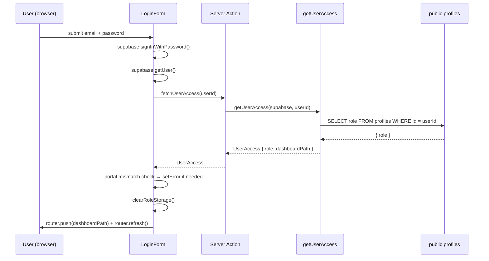

# Design Document: Role-Based Login Redirect

## Overview

Post-authentication redirects in the Medicare application are currently driven by the login-page portal selector and cached/localStorage role values instead of the authoritative `public.profiles.role` column in Supabase. This fix introduces a single canonical server-side resolver (`getUserAccess`) that every authentication path must call, eliminates all client-side role sources from redirect decisions, and tightens middleware-level route protection for admin routes.

---

## Bug Details

### Symptoms

After successful authentication — whether via email/password or Google OAuth — users are frequently redirected to `/dashboard` regardless of their actual role. Admin accounts land on the normal user dashboard; hospital and responder accounts bypass their portals. The login-page role selector can influence the destination, meaning a user who selects "Admin" but holds the `user` role may be routed toward `/admin`.

### Current Behavior

1. **Email/password path (`LoginForm`)**: Queries `profiles.role` from the DB but then maps it with inline logic that duplicates (and diverges from) `getRoleDashboardPath` in `get-user-role.ts`. There is no mismatch check between `selectedPortal` and the resolved role; `localStorage`/`sessionStorage` are never cleared; `router.refresh()` is called but a stale React cache can still surface old role data.

2. **Google OAuth path (`/auth/callback`)**: The inline `resolveUserPortal()` function re-implements role resolution independently. More critically, the `requestedPortal` query param (set by `LoginForm`'s Google button as `?portal=<selectedPortal>`) influences which branch executes, so a user who clicked "Admin" in the portal selector before hitting "Continue with Google" can be steered toward `/admin` even when their DB role is `user`.

3. **Middleware (`middleware.ts`)**: Admin routes (`/admin/*`) redirect unauthenticated users to `/admin/login` instead of `/login?next=...`. There is no server-side role check for authenticated non-admin users on admin routes — they reach `app/admin/layout.tsx` which does perform a DB check, but only after the page starts rendering.

4. **Missing profile row**: `getUserRole` in `get-user-role.ts` silently falls back to `'user'` if the profile row is missing, without logging or row creation.

5. **Navigation UI**: `TopNavbar` passes a hardcoded `userRole="user"` string to `NotificationDropdown` rather than deriving the role from the server session.

---

## Expected Behavior

- Every post-authentication redirect is driven exclusively by a fresh query to `public.profiles.role`.
- A single function (`getUserAccess`) is the only place that maps DB role values to dashboard paths.
- Email/password login shows an inline mismatch error when the portal selector doesn't match the DB role, then still redirects the user to their correct portal.
- Google OAuth ignores `?portal=` for redirect decisions; it may still read `?type=` for new-user application creation.
- Unauthenticated requests to `/admin/*` redirect server-side to `/login?next=<path>`.
- Authenticated non-admin requests to `/admin/*` redirect server-side to `/unauthorized`.
- A missing `profiles` row is auto-created (`role = 'user'`) with a dev-mode warning; the error is never swallowed.
- Navigation UI derives displayed items from the server-resolved DB role, not from `localStorage` or the portal selector.

---

## Hypothesized Root Cause

There is no single canonical resolver that all authentication paths call. Instead, role-to-path mapping is duplicated in at least three places:

1. `LoginForm.onEmailLogin` — inline `if/else` chain.
2. `callback/route.ts` — `resolveUserPortal()` inline function that also reads the `portal` query param.
3. `get-user-role.ts` — `getRoleDashboardPath()` which exists but is not called by either of the above.

Because each path has its own logic, they can diverge. When `LoginForm` passes `?portal=<selectedPortal>` to the Google OAuth redirect URL, the callback handler uses that param to steer the redirect, effectively allowing the client-supplied login-selector value to override the DB role. The fix is to collapse all three paths into a single `getUserAccess` call and remove every branch that reads client-supplied role metadata.

---

## Fix Implementation

### Architecture

```mermaid
graph TD
    A[LoginForm – email/password] -->|calls server action| C[getUserAccess]
    B[auth/callback – Google OAuth] -->|calls directly| C
    MW[middleware.ts] -->|server-side guard| D{admin route?}
    D -->|unauthenticated| E[/login?next=...]
    D -->|authenticated non-admin| F[/unauthorized]
    D -->|authenticated admin| G[allow]
    C -->|queries| H[(public.profiles)]
    C -->|queries| I[(portal_applications)]
    C -->|queries| J[(organization_members)]
    C -->|returns UserAccess| K{dashboardPath}
    K --> L[/admin]
    K --> M[/hospital]
    K --> N[/responder]
    K --> O[/dashboard]
    K --> P[/application-pending]
    K --> Q[/application-rejected]
```





```mermaid
sequenceDiagram
    participant CB as /auth/callback
    participant SB as Supabase Auth
    participant GA as getUserAccess

    CB->>SB: exchangeCodeForSession(code)
    SB-->>CB: session
    CB->>SB: getUser()
    SB-->>CB: { user }
    CB->>GA: getUserAccess(supabase, user.id)
    GA-->>CB: UserAccess { dashboardPath }
    note over CB: portal query param ignored for redirect
    CB->>CB: NextResponse.redirect(origin + dashboardPath)
```

### New File: `frontend/lib/auth/get-user-access.ts`

This module is the single source of truth. It supersedes the inline `resolveUserPortal` in `callback/route.ts` and consolidates with `get-user-role.ts` (which can remain for backward compatibility but should delegate to this module).

```typescript
import type { SupabaseClient } from "@supabase/supabase-js";
import type { ApplicationStatus } from "@/types/auth";

export type NormalizedRole =
  | "admin"
  | "hospital_staff"
  | "responder"
  | "volunteer"
  | "user";

export interface UserAccess {
  userId: string;
  role: NormalizedRole;
  applicationStatus?: ApplicationStatus;
  organizationId?: string;
  dashboardPath: string;
}

export function getRoleDashboardPath(role: NormalizedRole | string | null): string {
  switch (role) {
    case "admin":          return "/admin";
    case "hospital_staff":
    case "hospital":       return "/hospital";
    case "responder":
    case "volunteer":      return "/responder";
    default:               return "/dashboard";
  }
}

export async function getUserAccess(
  supabase: SupabaseClient,
  userId: string
): Promise<UserAccess> {
  // Step 1: Query profile row
  let { data: profile } = await supabase
    .from("profiles")
    .select("role, organization_id")
    .eq("id", userId)
    .single();

  // Step 2: Handle missing row — create default, warn in dev
  if (!profile) {
    if (process.env.NODE_ENV === "development") {
      console.warn("[getUserAccess] missing profile, created default", { userId });
    }
    await supabase.from("profiles").upsert(
      { id: userId, role: "user", is_verified: false, updated_at: new Date().toISOString() },
      { onConflict: "id" }
    );
    profile = { role: "user", organization_id: null };
  }

  // Step 3: Normalize role
  const rawRole = profile.role as string;
  let role: NormalizedRole = "user";
  if (rawRole === "admin")                               role = "admin";
  else if (rawRole === "hospital_staff" || rawRole === "hospital") role = "hospital_staff";
  else if (rawRole === "responder")                      role = "responder";
  else if (rawRole === "volunteer")                      role = "volunteer";

  const organizationId = profile.organization_id ?? undefined;

  // Step 4: Elevated roles → direct path, no application check
  if (role !== "user") {
    const dashboardPath = getRoleDashboardPath(role);
    if (process.env.NODE_ENV === "development") {
      console.log("[getUserAccess]", { userId, role, dashboardPath });
    }
    return { userId, role, organizationId, dashboardPath };
  }

  // Step 5: user role → check portal_applications
  const { data: app } = await supabase
    .from("portal_applications")
    .select("status")
    .eq("user_id", userId)
    .order("created_at", { ascending: false })
    .limit(1)
    .maybeSingle();

  let dashboardPath = "/dashboard";
  let applicationStatus: ApplicationStatus | undefined;

  if (app) {
    applicationStatus = app.status as ApplicationStatus;
    if (app.status === "pending")   dashboardPath = "/application-pending";
    if (app.status === "rejected")  dashboardPath = "/application-rejected";
    if (app.status === "suspended") dashboardPath = "/login?error=suspended";
  }

  if (process.env.NODE_ENV === "development") {
    console.log("[getUserAccess]", { userId, role, dashboardPath });
  }

  return { userId, role, applicationStatus, organizationId, dashboardPath };
}
```

**Redirect map**:

| DB `profiles.role`        | `NormalizedRole`  | `dashboardPath`           |
|---------------------------|-------------------|---------------------------|
| `admin`                   | `admin`           | `/admin`                  |
| `hospital_staff`          | `hospital_staff`  | `/hospital`               |
| `hospital` (legacy alias) | `hospital_staff`  | `/hospital`               |
| `responder`               | `responder`       | `/responder`              |
| `volunteer`               | `volunteer`       | `/responder`              |
| `user` (no app)           | `user`            | `/dashboard`              |
| `user` + pending app      | `user`            | `/application-pending`    |
| `user` + rejected app     | `user`            | `/application-rejected`   |
| `user` + suspended app    | `user`            | `/login?error=suspended`  |
| profile row missing       | `user` (created)  | `/dashboard`              |

---

### Changes to `LoginForm.tsx`

1. **Remove** the inline role `if/else` chain after `signInWithPassword`.
2. **Add** a call to a thin Next.js Server Action (`actions/auth.ts: fetchUserAccess`) that wraps `getUserAccess`. This keeps the resolver server-side while being callable from a client component.
3. **Add** portal mismatch check and inline error display.
4. **Add** `clearRoleStorage()` call before `router.push`.
5. **Add** `isNextAuthorized` guard for `?next=` param.

```typescript
// Relevant excerpt — onEmailLogin after successful signInWithPassword + getUser()

const access = await fetchUserAccess(); // server action

// Mismatch check
const portalToRoles: Record<LoginPortal, NormalizedRole[]> = {
  admin:     ["admin"],
  hospital:  ["hospital_staff"],
  responder: ["responder", "volunteer"],
  user:      ["user"],
};
if (!portalToRoles[selectedPortal]?.includes(access.role)) {
  const messages: Record<LoginPortal, string> = {
    admin:     "This account does not have administrator access.",
    hospital:  "This account is not registered as hospital staff.",
    responder: "This account is not registered as a responder.",
    user:      "This account has elevated access. Redirecting to your portal.",
  };
  setError(messages[selectedPortal] ?? "Portal mismatch. Redirecting to your portal.");
  // Fall through — still redirect below
}

// Clear stale storage
clearRoleStorage();

// Honour ?next= only if role is authorized
let destination = access.dashboardPath;
const rawNext = searchParams.get("next");
if (rawNext && isNextAuthorized(rawNext, access.role)) {
  destination = rawNext;
}

router.push(destination);
router.refresh();
```

---

### Changes to `callback/route.ts`

1. **Import** `getUserAccess` from `@/lib/auth/get-user-access`.
2. **Remove** the `resolveUserPortal` inline function.
3. **Replace** all redirect branching that reads `requestedPortal` with a single `getUserAccess` call.
4. **Retain** `?type=` param for new-user application creation (unchanged).

```typescript
// After exchangeCodeForSession + getUser():

const access = await getUserAccess(supabase, user.id);

// New-user registration flow (type param only)
const registrationType = searchParams.get("type") as RegistrationType | null;
if (registrationType === "hospital" || registrationType === "responder") {
  await createApplication(supabase, user.id, registrationType);
  return NextResponse.redirect(`${origin}/application-pending`);
}

// All existing users — portal param is irrelevant
return NextResponse.redirect(`${origin}${access.dashboardPath}`);
```

---

### Changes to `middleware.ts`

Replace the admin-route guard block:

```typescript
// Before (buggy):
if (isAdminRoute && !user) {
  redirectUrl.pathname = "/admin/login";   // ← wrong
  ...
}
// No check for authenticated non-admin on admin routes

// After (fixed):
if (isAdminRoute) {
  if (!user) {
    const redirectUrl = request.nextUrl.clone();
    redirectUrl.pathname = "/login";
    redirectUrl.searchParams.set("next", pathname);
    return NextResponse.redirect(redirectUrl);
  }

  const { data: profile } = await supabase
    .from("profiles")
    .select("role")
    .eq("id", user.id)
    .single();

  if (profile?.role !== "admin") {
    const redirectUrl = request.nextUrl.clone();
    redirectUrl.pathname = "/unauthorized";
    return NextResponse.redirect(redirectUrl);
  }
  // Admin confirmed — fall through
}
```

Also remove `/admin/login` from `publicOnlyRoutes` — once the middleware above is in place that route is no longer a meaningful destination.

---

### Changes to Navigation UI

**`TopNavbar`**: Accept a `role: NormalizedRole` prop passed from the server layout. Remove any `localStorage` reads for role. Pass `role` to `NotificationDropdown` instead of the hardcoded `"user"` string.

**Server layouts** (`app/dashboard/layout.tsx`, `app/hospital/layout.tsx`, `app/responder/layout.tsx`): Call `getUserAccess` and pass `access.role` as a prop to nav components.

---

### New Helpers — `frontend/lib/auth/storage.ts`

```typescript
const ROLE_STORAGE_KEYS = ["userRole", "portal", "selectedPortal", "loginPortal", "role"];

export function clearRoleStorage(): void {
  if (typeof window === "undefined") return;
  ROLE_STORAGE_KEYS.forEach((k) => {
    localStorage.removeItem(k);
    sessionStorage.removeItem(k);
  });
}

export function isNextAuthorized(next: string, role: NormalizedRole): boolean {
  if (next.startsWith("/admin"))     return role === "admin";
  if (next.startsWith("/hospital"))  return role === "hospital_staff";
  if (next.startsWith("/responder")) return role === "responder" || role === "volunteer";
  if (next.startsWith("/dashboard")) return role === "user";
  return false;
}
```

---

## Correctness Properties

### Property 1: Single Resolver Invariant

For any authenticated user, `getUserAccess(supabase, userId).dashboardPath` equals `getRoleDashboardPath(getUserAccess(supabase, userId).role)` unless the user has a pending/rejected/suspended application (in which case `dashboardPath` overrides the role default). Every authentication path uses this one function — no inline mapping exists elsewhere.

**Validates: Requirements 2.10**

### Property 2: Portal Mismatch Does Not Change DB Role

The `protect_profile_auth_fields` trigger and the absence of any `UPDATE profiles SET role = ...` call in `LoginForm` guarantee that a portal-selector mismatch never mutates `profiles.role`. The mismatch only surfaces an inline error message; the DB state is unchanged.

**Validates: Requirements 2.3, 3.9**

### Property 3: `?next=` Authorization Soundness

`isNextAuthorized(next, role) === true` implies `next` starts with a path prefix that corresponds to `role`'s authorized portal. There is no input where a `user`-role account can be redirected to `/admin` via `?next=`, and no input where an `admin`-role account is blocked from its own portal.

**Validates: Requirements 2.5, 3.10**

### Property 4: Missing-Row Idempotency

Calling `getUserAccess` twice for a user with no profile row produces the same `UserAccess` value both times. The upsert uses `onConflict: "id"` which is safe to call repeatedly without duplicating rows or changing role values set by subsequent DB operations.

**Validates: Requirements 2.6**

### Property 5: No Token Leakage in Dev Logs

Dev-mode log output from `getUserAccess` (via `console.log` / `console.warn`) never contains strings matching JWT patterns (`eyJ[A-Za-z0-9._-]{20,}`) or `Bearer` token strings. Logged fields are restricted to `{ userId, role, dashboardPath }`.

**Validates: Requirements 2.9**

---

## Testing Strategy

### Unit Tests

- `getRoleDashboardPath` — all six DB enum values (including legacy `'hospital'` alias) and `null`.
- `isNextAuthorized` — full matrix of path prefixes × roles.
- `clearRoleStorage` — mock `window.localStorage`/`sessionStorage`, verify keys removed.
- `getUserAccess` with mocked Supabase client:
  - Each role value → correct `dashboardPath`.
  - Missing profile row → upsert called, dev warning logged, `'user'` role returned.
  - `user` + `pending` application → `/application-pending`.
  - `user` + `rejected` application → `/application-rejected`.
  - `user` + `suspended` application → `/login?error=suspended`.
  - `user` + no application → `/dashboard`.

### Property-Based Tests (`fast-check`)

- For any `NormalizedRole`, `getRoleDashboardPath(role)` returns a non-empty string starting with `/`.
- For any role, `isNextAuthorized(next, role) === false` for paths not matching the role's portal.
- Dev log output never matches `/eyJ[A-Za-z0-9._-]{20,}/` (JWT pattern).

### Integration Tests

- Email/password login as `admin` → lands on `/admin`, no `localStorage` role keys remain.
- Email/password login with `admin` portal selector + `user` DB role → inline mismatch error shown, still redirects to `/dashboard`.
- Google OAuth login as `hospital_staff` with `?portal=user` in callback URL → redirects to `/hospital`.
- `GET /admin/dashboard` (no session) → 302 to `/login?next=/admin/dashboard`.
- `GET /admin/dashboard` (authenticated `responder`) → 302 to `/unauthorized`.
- `GET /admin/dashboard` (authenticated `admin`) → 200.
- Login with `?next=/admin` as `admin` → honoured, lands on `/admin`.
- Login with `?next=/admin` as `user` → ignored, lands on `/dashboard`.

---

## Security Considerations

- **No client-supplied role trust**: `getUserAccess` always queries the DB; it never reads `localStorage`, JWT custom claims, or query params for the redirect role.
- **DB trigger protection**: The existing `protect_profile_auth_fields` trigger prevents Supabase client calls from modifying `profiles.role`, `organization_id`, `responder_type`, or `is_verified` — this layer is not modified.
- **Edge middleware enforcement**: Admin route checks run at the edge before any React rendering, preventing layout-level bypass.
- **`?next=` validation**: `isNextAuthorized` prevents supply of `?next=/admin` for a non-admin session from being honoured.
- **No token logging**: Dev logging is scoped to `{ userId, role, dashboardPath }` only.
- **`/admin/login` deprecation**: Once middleware redirects to `/login?next=...`, the `/admin/login` page becomes a dead end and should redirect to `/login` to avoid user confusion.

---

## Dependencies

- `@supabase/ssr` — server-side Supabase client (already in use)
- `@supabase/supabase-js` — `SupabaseClient` type (already in use)
- `next/navigation` — `redirect`, `NextResponse` (already in use)
- `fast-check` — property-based test library (add as `devDependency` if not already present)
- No new runtime dependencies required

---

## Glossary

| Term | Definition |
|------|------------|
| `NormalizedRole` | The canonical set of role values used throughout the application: `admin`, `hospital_staff`, `responder`, `volunteer`, `user`. Aliases like `'hospital'` are normalized on read. |
| `UserAccess` | The return type of `getUserAccess`: `{ userId, role, applicationStatus?, organizationId?, dashboardPath }`. |
| `dashboardPath` | The resolved URL path a user should be redirected to after authentication, derived from DB role and application status. |
| Portal selector | The login-page UI control (`PortalSelector`) that lets users choose a portal before signing in. Used only for UX hints and new-user application creation; never used to determine the redirect destination. |
| `?next=` param | A query parameter on `/login` that requests a post-login redirect. Honoured only when the resolved DB role is authorized for that path. |
| `portal_applications` | Supabase table tracking hospital/responder application submissions and their approval status. |
