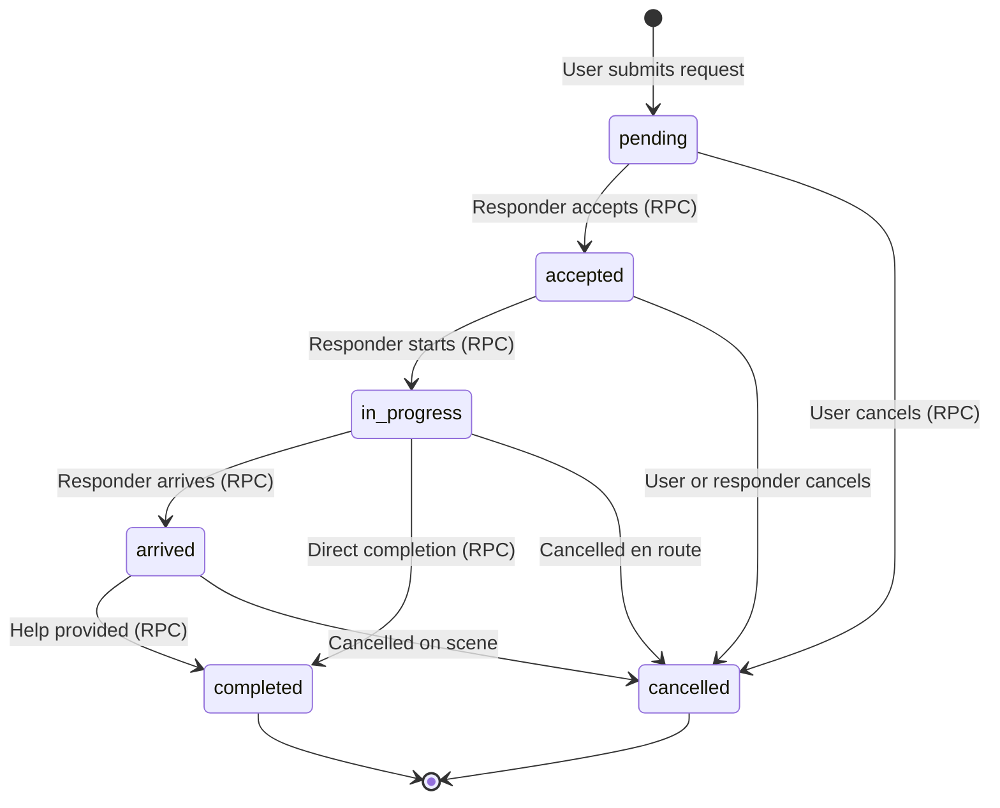

# Emergency Request Status State Machine

## States

| State | Who sets it | Description |
|---|---|---|
| `pending` | System (on insert) | Request submitted, awaiting responder |
| `accepted` | Responder (via RPC) | Responder claimed the request |
| `in_progress` | Responder (via RPC) | Responder en route |
| `arrived` | Responder (via RPC) | Responder at scene |
| `completed` | Responder (via RPC) | Request fulfilled |
| `cancelled` | User or Responder (via RPC) | Request cancelled |

Legacy states (`volunteer_assigned`, `hospital_assigned`) are kept in the enum for compatibility but new code should use `accepted`/`in_progress`.

## Allowed Transitions

```
pending ──→ accepted
pending ──→ cancelled (user can cancel their own pending request)

accepted ──→ in_progress
accepted ──→ cancelled

in_progress ──→ arrived
in_progress ──→ completed
in_progress ──→ cancelled

arrived ──→ completed
arrived ──→ cancelled

completed ──→ (TERMINAL — no transitions allowed)
cancelled ──→ (TERMINAL — no transitions allowed)
```

## State Diagram



## Enforcement

Transitions are enforced in **two places**:

1. **Database RPC** — `update_emergency_request_status()` validates the transition in a `CASE` statement with row-level locking (`FOR UPDATE`).
2. **Backend Pydantic** — `EmergencyRequestStatus.allowed_next()` method allows the API layer to validate before making a DB call.

Frontend validation is UI-only and is **not trusted** for security.

## Timestamp Columns

Each state change sets the corresponding timestamp:

| State | Timestamp Column |
|---|---|
| accepted | accepted_at, assigned_at |
| in_progress | in_progress_at |
| arrived | arrived_at |
| completed | completed_at |
| cancelled | cancelled_at |
